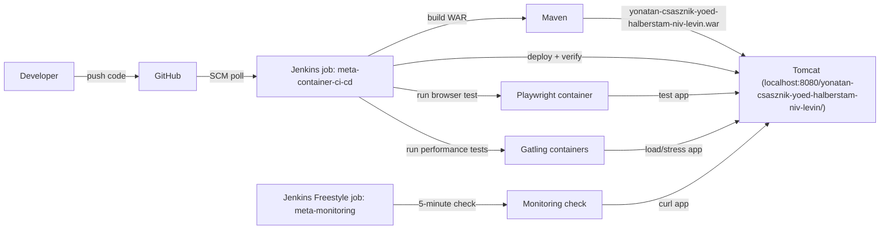
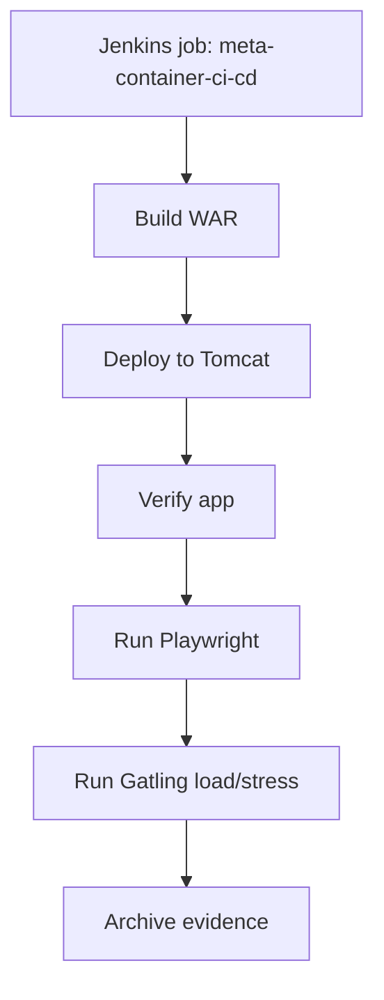
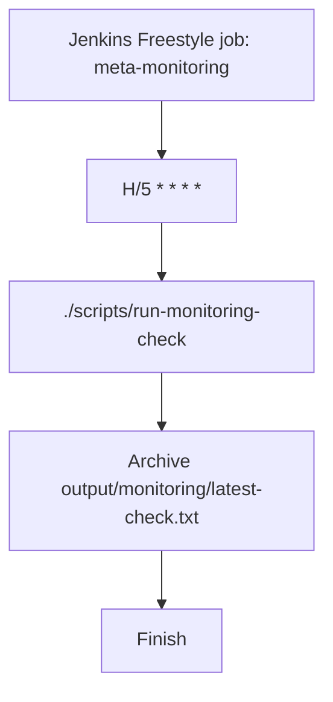

# Technical Architecture

## Overview

The project uses a Jenkins Pipeline job for CI/CD and a Jenkins Freestyle job for monitoring. The CI/CD job pulls code from GitHub, builds the WAR, deploys it to Tomcat, verifies the app, and runs the required automated checks. The separate monitoring job checks the deployed app every 5 minutes, matching the instructor-confirmed monitoring split.

## CI/CD Pipeline

The CI/CD job is `meta-container-ci-cd` and uses script path `Jenkinsfile`. It runs on SCM polling or manual execution. It does not contain the monitoring schedule.

## Monitoring Job

The monitoring job is `meta-monitoring`. It is a Freestyle project with a periodic trigger and an Execute shell step that runs `./scripts/run-monitoring-check`.

## Runtime Notes

- Tomcat serves the app at `http://localhost:8080/yonatan-csasznik-yoed-halberstam-niv-levin/`.
- Jenkins is available at `http://localhost:8081/`.
- Jenkins uses Docker only to start disposable Playwright and Gatling test containers.
- The scheduled monitoring job must not rebuild, redeploy, or run Playwright/Gatling.
- Generated evidence is written under `output/` and stays out of Git.

## Plan Status

Plan 06 is completed: it added the Playwright functional test, container runner, Jenkins execution path, and evidence documentation.
