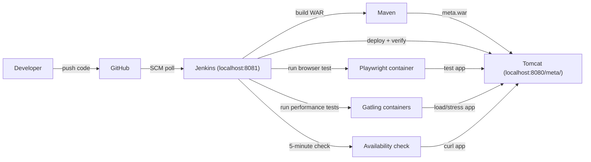
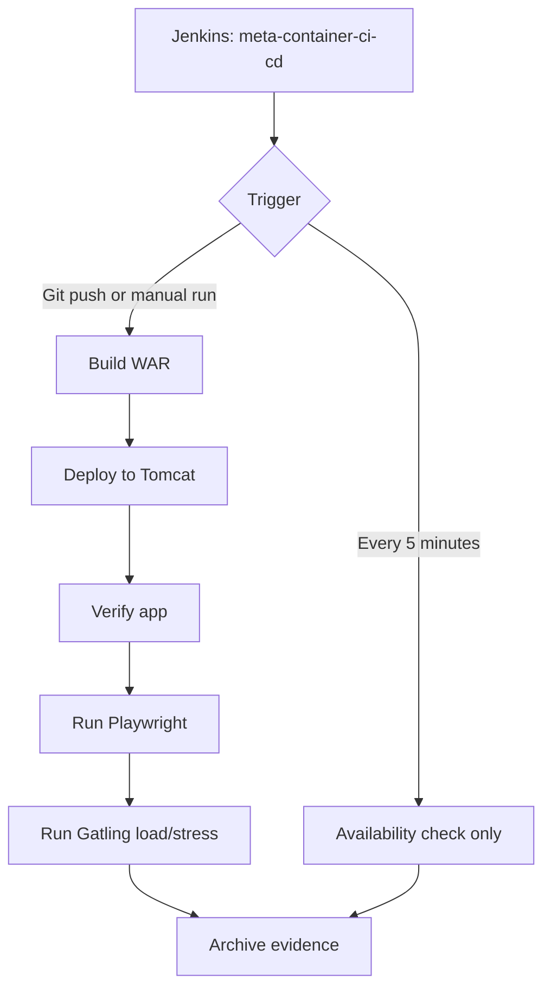

# Technical Architecture

## Overview

The project is one Jenkins-driven CI/CD pipeline for a JSP application. Jenkins pulls the code from GitHub, builds the WAR, deploys it to Tomcat, verifies the app, and runs the required automated checks.

## CI/CD Pipeline

The assignment asks for a single CI/CD pipeline. This Jenkins job keeps one pipeline while using trigger-aware stages: source changes run the build/deploy/test path, and timer runs only the availability check.

## Runtime Notes

- Tomcat serves the app at `http://localhost:8080/meta/`.
- Jenkins is available at `http://localhost:8081/`.
- Jenkins uses Docker only to start disposable Playwright and Gatling test containers.
- Timer-triggered runs must not rebuild, redeploy, or run Playwright/Gatling.
- Generated evidence is written under `output/` and stays out of Git.

## Plan Status

Plan 06 is completed: it added the Playwright functional test, container runner, Jenkins execution path, and evidence documentation.
