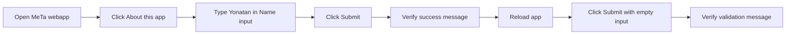

# HAR Scenario

## Target

- Host browser URL: `http://localhost:8080/yonatan-csasznik-yoed-halberstam-niv-levin/`
- Docker-network URL: `http://tomcat:8080/yonatan-csasznik-yoed-halberstam-niv-levin/`

## What This HAR Tests



This HAR documents the network traffic for the same browser journey covered by the Playwright functional test: page load, link navigation, valid form submission, and empty-submit validation. It proves that the deployed Tomcat app can serve the JSP page and handle both the successful and rejected form submissions used by the browser automation scenario.

Expected network behavior:

1. Browser requests the application page at `/yonatan-csasznik-yoed-halberstam-niv-levin/`.
2. Browser clicks `About this app`; this changes the URL fragment to `#about` and should not create a separate network request because the target section is already on the same page.
3. Browser submits the form to `/yonatan-csasznik-yoed-halberstam-niv-levin/index.jsp` with `nameInput=Yonatan`.
4. Tomcat returns an HTTP `200` response containing the success message `Hello, Yonatan. MeTA Corporate reviewed your form, opened a committee, and somehow approved it.`
5. Browser reloads the application page, submits the form with an empty `nameInput`, and Tomcat returns an HTTP `200` response containing the validation message `Please enter a name before MeTA Corporate schedules a meeting about the empty box.`

This HAR does not test Jenkins scheduling, Gatling performance limits, public-IP availability, or monitor uptime. Those are separate final-project evidence items.

## Capture Command

Run the default Dockerized capture from the project root:

```sh
./scripts/capture-har
```

`scripts/capture-har` does not call `scripts/run-playwright-container`. Both scripts use the same official Playwright image, but `capture-har` launches a separate disposable container so the HAR validation cannot inherit browser or filesystem state from the functional Playwright test.

The disposable HAR capture container name is configurable with `HAR_CONTAINER_NAME`. By default local runs use `meta-har-local` and Jenkins-triggered runs use `meta-har-<build-number>`.

## Evidence Files

- `output/har/meta-functional-flow.har`
- `output/har/har-capture.log`

## Validation

Validate the generated HAR from the project root:

```sh
./scripts/validate-har output/har/meta-functional-flow.har
```

The validator must print `Validated HAR: output/har/meta-functional-flow.har entries=<count> groupContextRequests=<count>`.

## Submission Notes

Attach `output/har/meta-functional-flow.har` as the HAR file for the final submission package. Use the Mermaid flow in `What This HAR Tests` as the written HAR scenario description.

## Sensitivity Review

Review the HAR before external sharing. HAR files may include request headers, response headers, cookies, embedded response content, URLs, and cache metadata.
