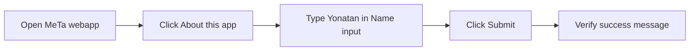

# HAR Scenario

## Target

- Host browser URL: `http://localhost:8080/meta/`
- Docker-network URL: `http://tomcat:8080/meta/`

## What This HAR Tests



This HAR documents the network traffic for the JSP application functional flow. It proves that the deployed Tomcat app can serve the JSP page and handle the form submission used by the browser automation scenario.

Expected network behavior:

1. Browser requests the application page at `/meta/`.
2. Browser clicks `About this app`; this changes the URL fragment to `#about` and should not create a separate network request because the target section is already on the same page.
3. Browser submits the form to `/meta/index.jsp` with `nameInput=Yonatan`.
4. Tomcat returns an HTTP `200` response containing the success message `Hello, Yonatan. Your JSP form submission worked.`

This HAR does not test Jenkins scheduling, Gatling performance limits, public-IP availability, or monitor uptime. Those are separate final-project evidence items.

## Capture Command

Run the default Dockerized capture from the project root:

```sh
./scripts/capture-har
```

`scripts/capture-har` does not call `scripts/run-playwright-container`. Both scripts use the same official Playwright container image, but `capture-har` runs `tests/playwright/capture-har.js` so it can record HAR traffic, while `run-playwright-container` runs the functional Playwright test suite.

If the capture container cannot reach Docker network service name `tomcat`, run the host-reachable fallback from the project root:

```sh
APP_BASE_URL=http://host.docker.internal:8080/meta/ PLAYWRIGHT_NETWORK=bridge ./scripts/capture-har
```

The disposable HAR capture container name is configurable with `HAR_CONTAINER_NAME`. By default local runs use `meta-har-local` and Jenkins-triggered runs use `meta-har-<build-number>`.

## Evidence Files

- `output/har/meta-functional-flow.har`
- `output/har/07-har-capture.log`

## Validation

Validate the generated HAR from the project root:

```sh
./scripts/validate-har output/har/meta-functional-flow.har
```

The validator must print `Validated HAR: output/har/meta-functional-flow.har entries=<count> metaRequests=<count>`.

## Submission Notes

Attach `output/har/meta-functional-flow.har` as the HAR file for the final submission package. Use the Mermaid flow in `What This HAR Tests` as the written HAR scenario description.

## Sensitivity Review

Review the HAR before external sharing. HAR files may include request headers, response headers, cookies, embedded response content, URLs, and cache metadata.
